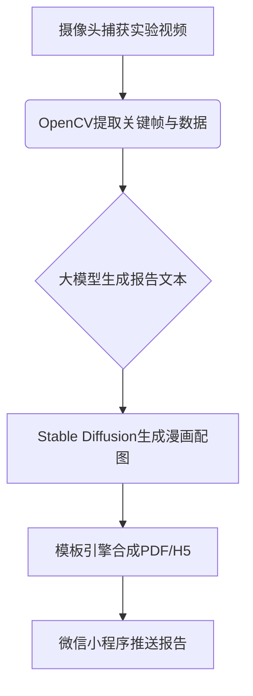

---

### **一、个性化漫画式实验报告**  
#### **1. 核心功能设计**  
- **动态数据采集**：  
  - 通过摄像头+OpenCV实时捕获实验关键节点（如电阻色环识别、万用表读数、接线动作）。  
  - 记录时间戳数据（如操作时长、错误次数）。  

- **报告内容生成**：  
  - **结构化数据输入**：  
    ```json  
    {  
      "实验目标": "测量未知电阻阻值",  
      "操作亮点": ["色环识别准确", "量程选择合理"],  
      "典型错误": ["未校零导致读数偏差2Ω", "导线接触不良"],  
      "生活类比": "你测的电阻相当于5个LED灯串联！"  
    }  
    ```  
  - **大模型生成文案**：  
    - 用大模型接口将数据转化为**口语化点评**，例如：  
      > “哇！你的色环解码比火箭还快！不过下次记得先校零，否则误差会像偷偷吃掉你数据的‘小怪兽’哦~”  

- **漫画插图生成**：  
  - **分镜脚本**：根据实验步骤自动生成4-6格漫画，例如：  
    1. 学生皱眉识别色环（问题引入）；  
    2. 虚拟导师举提示牌（错误纠正）；  
    3. 电阻变身超级英雄（成功测量）；  
    4. 数据图表+生活类比（知识延伸）。  
  - **图像生成工具**：  
    - **低成本方案**：使用`Stable Diffusion + ControlNet`，通过线稿控制漫画风格（如提示词：“cartoon style, lab scene, vibrant colors”）。  
    - **快速实现**：利用预设漫画模板（Canva/PSD）替换动态元素（如人物表情、电阻数值）。  

- **报告输出**：  
  - **PDF/图片格式**：适合打印或课堂展示。  
  - **动态H5页面**：嵌入GIF动画（如电阻冒汗表情），扫码即可分享。  

#### **2. 技术实现流程**  


#### **3. 低成本优化技巧**  
- **减少生成耗时**：预生成常见场景漫画（如“成功”“短路警告”），仅动态替换文字和数值。  
- **轻量化模型**：使用腾讯云或阿里云的API服务（如图文生成），避免本地部署大模型。  

---

### **二、微信小程序集成方案**  
#### **1. 核心功能模块**  
- **实时评分看板**：  
  - 实验过程中，小程序同步显示动态评分（如“操作规范度: 85/100”），通过WebSocket与摄像头端通信。  
  - 评分维度可视化：用雷达图展示“色环识别”“仪器操作”“数据记录”等维度得分。  

- **漫画报告展示**：  
  - 支持点击放大、保存图片、一键分享到班级群。  
  - 添加“成就系统”：收集不同主题漫画（如“电阻大师”“电路侦探”），激励学生反复练习。  

- **附加互动功能**：  
  - **实验回放**：上传视频片段+AI语音解说（如“02:15秒时，你的万用表握持角度影响读数啦！”）。  
  - **排行榜挑战**：班级/全校排名，周冠军可解锁专属漫画边框。  

#### **2. 技术选型与接口设计**  
- **前端框架**：微信小程序原生开发+Taro跨端框架（兼容未来多平台扩展）。  
- **关键API**：  
  - **报告生成接口**：  
    ```python  
    # 示例：Flask后端接收数据并返回报告URL  
    @app.route('/generate_report', methods=['POST'])  
    def generate_report():  
        data = request.json  
        report_id = save_to_database(data)  
        return {'url': f'https://your-domain.com/report/{report_id}'}  
    ```  
  - **实时评分推送**：使用WebSocket或MQTT协议（适合低延迟场景）。  

#### **3. 界面设计建议**  
- **主页**：  
  - 顶部大屏展示实时实验画面（缩略图），下方浮动评分球（类似游戏血条）。  
- **报告页**：  
  - 左滑查看漫画分镜，右滑查看详细数据对比。  
  - 底部添加“老师点评”按钮（教师可扫码补充语音评价）。  

---

### **三、增强展示性的技巧**  
1. **“生成过程可视化”彩蛋**：  
   - 在展会演示时，点击小程序报告页的“AI工作室”按钮，播放快进视频展示“AI如何从数据到漫画”。  

2. **实体道具联动**：  
   - 为电阻元件粘贴**NFC标签**，学生用手机贴近即可在小程序查看该电阻的历史实验记录（如“被测量过32次，最高得分98”）。  

3. **AR合影打卡**：  
   - 实验完成后，小程序生成**AR虚拟实验室背景**，学生可手持漫画报告与虚拟导师（如爱因斯坦卡通形象）合影。  

---

### **四、预期效果示例**  
假设学生测量一个470Ω电阻：  
1. 实验结束时，微信弹出通知：“你的漫画报告已出炉！点击查看→”；  
2. 打开报告页：  
   - 第一格漫画：学生角色头顶问号，色环被放大标注“黄-紫-棕-金”；  
   - 第二格：虚拟导师举牌提示“别忘记×10倍哦！”；  
   - 第三格：电阻变身“470Ω战士”击败误差怪兽；  
   - 底部数据栏显示：“班级排名：TOP 12% | 超越89%的同学”。  

---

以上方案强调**低成本高互动性**，大部分功能可通过现有开源工具+云服务实现，适合大学生团队快速落地并突出展示亮点。